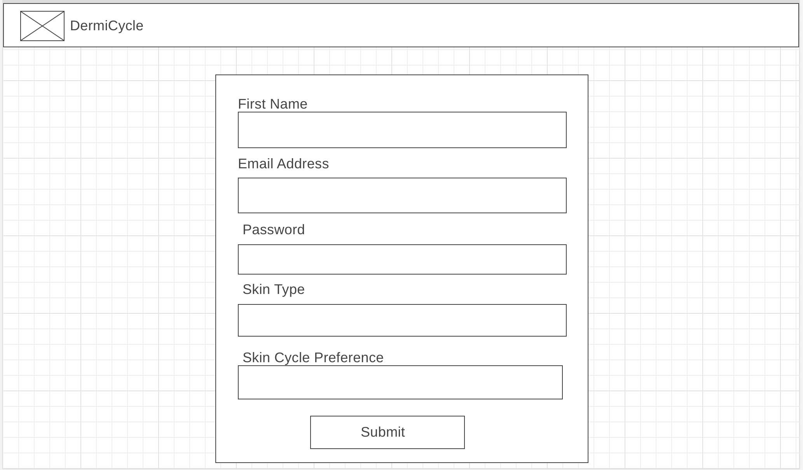

# DermiCycleFrontend

DermiCycle is a skincare cycling application that allows you to track what products to use at what stage.

## Introduction

 The term "skin cycling" is all about taking a cyclical approach to your facial skincare routine. Why? Using specific products on different days regenerates the skin and improves skin quality. Choose between a four-night or a three-night cycle alternates an exfoliant, retinol-based product, and hydrating cream or concentrate.  

## Features and Basics
DermiCycle is an application designed to help users manage their skincare routines by providing a daily list of products to use respective to the stage within your skin cycling pattern. Here are the key features and basics of DermiCycle:

- Sign In: Users can create an account to save personal information and preferences, skin type, and skin cycle preference
- Product List: The application provides a list that allows users to customize their skin cycling pattern for the entire month.
- Product Tracking: Users can input the skincare products they have for each stage and manage their routine.

## Technologies Used
- Angular
- TypeScript
- Bootstrap

## Hurdles and Solutions
During the development of this project, I encountered several hurdles related to API requests and responsive design. Here's an overview of the challenges I faced and the solutions I implemented to overcome them:

#### Issue 1: API Request Data Mismatch
Problem: My "Create an Account" page was not sending the correct information to the server. Specifically, it was saving the email as the first name and the first name as the email, leading to data inconsistency.

- Solution: To resolve this issue, I performed the following steps:

- Code Review: I thoroughly reviewed my code to identify the source of the problem.

HTML Input Types: I realized that the HTML inputs had the wrong types assigned to them, causing the mix-up. I corrected the input types to ensure that the data entered matched the expected format.

Request Body Parameters: I also had to fix the order of the parameters in the request body of my user.service.ts file. By aligning the parameters correctly, I ensured that the data sent to the server was in the right format.

#### Issue 2: Responsive Design for Landing Component
Problem: My "Landing" component was not responsive, and the components were not centered on various devices and screen sizes.

- Solution: To make my landing page responsive and center the components, I took the following steps:

CSS Styling: I applied CSS styles to the landing components to ensure they adapt to different screen sizes. This included setting responsive width and height properties, as well as using CSS flexbox or grid layouts to center elements.

Media Queries: I used media queries to define specific styles for different screen sizes, ensuring a consistent and visually appealing layout across various devices.

Testing: I thoroughly tested the landing page on different devices and screen sizes to confirm that the components were centered and the layout was responsive.

By addressing these hurdles, I was able to improve the functionality and user experience of my project. This documentation serves as a reference for future development and troubleshooting.

## WireFrames

### Login Page

### Create Account Page

### Welcome Page

### Add Product Page

### Daily Product List Page

## Installation Guide

`git clone <this repo url>`

make sure to head to the backend api to have this application work with the api calls 
(https://github.com/avrubio/DermiCycle-BackEnd)

 `cd /dermicycle-frontend`
 `npm install`
`ng serve -o`
## Acknowledgements
[Leo Rodriguez](https://github.com/LRodriguez92) - helped me properly set up my API calls to make sure I was retrieving the proper response.
